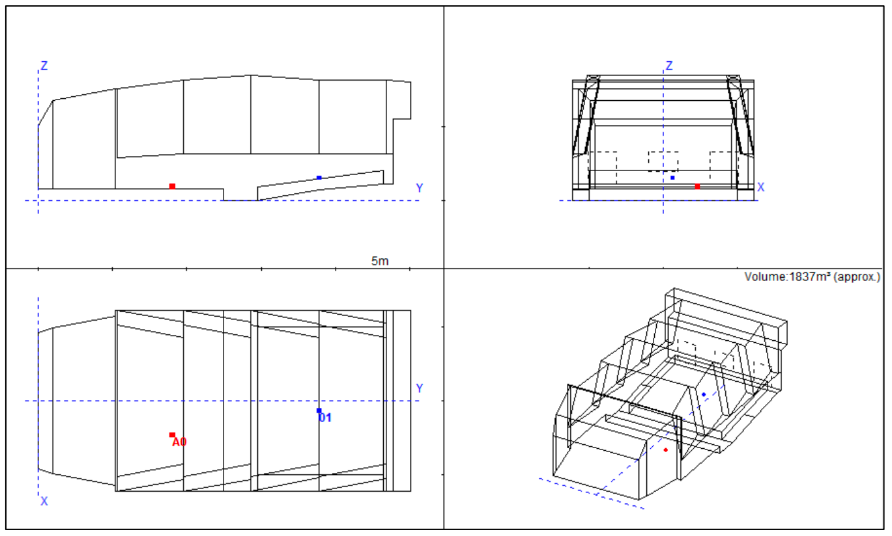
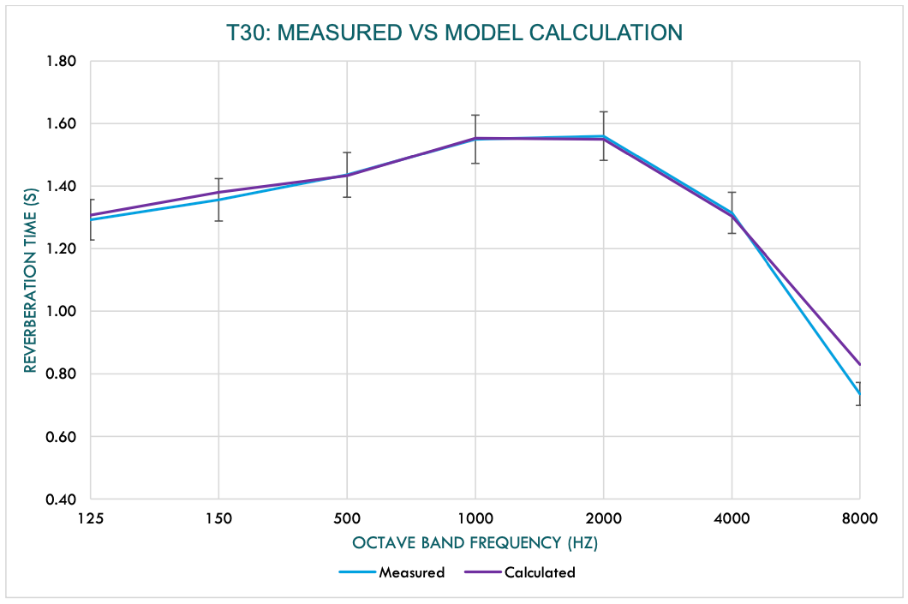
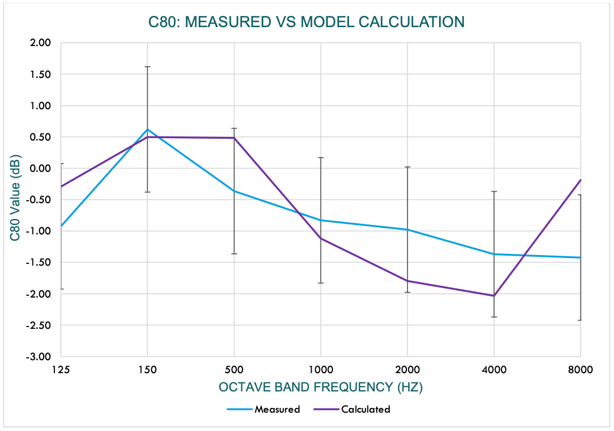
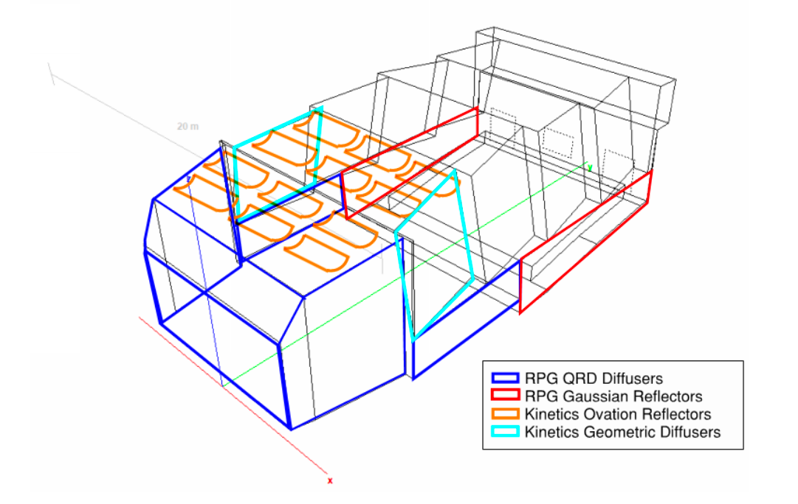

# Acoustical Analysis of the Abramson Family Recital Hall
### Senior Capstone Project, Elizabeth Grzyb, Class of 2019

Dear American University Facilities Team,

Through my senior thesis this semester, I explored the acoustics of American University’s Abramson Recital Hall and developed solutions to improve the acoustics of the space. My study involved measuring the acoustics of the space, building a computer model based on the hall’s acoustics, providing recommendations, and modeling how these recommendations would improve the acoustics of the hall. I hope that this report can outline a path forward on how to solve the spaces acoustical problems.

## Executive Summary

After conducting acoustic testing at the Abramson Recital Hall, I found that the reverberation time of the hall is adequate for a hall of its size, but the hall’s acoustic performance suffers from lack of speech intelligibility, lack of onstage communication, and harsh distracting flutter echoes. Adding ceiling reflectors to the ceiling onstage can help increase onstage communication and introducing diffusive panels to the stage walls and audience walls will increase clarity and decrease flutter echoes. Additionally, I modeled these changes in an acoustic modeling software to quantitatively show that these changes would greatly increase the speech intelligibility, increase music clarity, and maintain the hall’s current reverberation time.

## Testing and Observations
On April 3rd, 2019 I visited the Abramson Recital Hall to take acoustic measurements of the space. To conduct the testing, I played a logarithmic sine sweep over a QSC monitor and recorded the response of the room with an Earthworks small diaphragm condenser microphone. From this data, I measured a variety of parameters that describe the clarity of music played in the hall, how easy it is to understand someone on stage addressing the audience, and the amount of reverberation in the hall.
### Clarity
After speaking with students and faculty that regularly perform in the recital hall, many expressed that it is difficult to hear and understand music played by performers on the stage. To help quantify the onstage communication and the overall clarity of music in the hall, I measured a parameter called the clarity index (C80) that describes clarity as a ratio of early sound energy (reflections returning to the listener within 80ms of the original sound), to late sound energy (reflections returning to the listener 80ms after the original sound). Typically, halls intended for musical performance have a clarity index between -4dB and - 1dB and halls designed for speech have a clarity index greater than 0dB. In general, halls intended for multiple uses are considered to have acceptable clarity with a C80 value anywhere between -4db and +1db. Upon analysis of test data, I found Abramson’s clarity index to be within this acceptable range as all measurements fell between -3.25dB and +2.19dB.
### Speech Intelligibility
Like C80, the speech transmission index (STI) is parameter that helps describe clarity in a space. While C80 is a value that is most frequently used to determine the clarity of music, STI is a parameter that is
specifically used to describe the intelligibility of speech in a room. The STI of a space can be measured by playing a modulated test signal into a room and recording the room’s response, calculated from the impulse response of a room, or calculated from a computer model built to simulate the space. STI values range from 0 (no speech intelligibility) to 1 (high level of speech intelligibility). Table 1 below outlines the typical STI values for common room types.

| STI Range     | Quality       | Examples of Typical Uses |
| :-----------: | :-----------: | :-----------: |
| > 0.76        | Excellent     |Recording Studios      |
| 0.72 - 0.76   | Good          |Theaters, Speech Auditoria, Courts       |
| 0.68 - 0.72   | Good          |Theaters, Speech Auditoria, Courts      |
| 0.64 - 0.68   | Good          |Teleconference Rooms, Theaters    |
| 0.60 - 0.64   | Good          |Classrooms, Concert Halls      |
| 0.56 - 0.60   | Fair          |Concert Halls, Modern Churches      |
| 0.52 - 0.56   | Fair          |PA in Shopping Malls, Cathedrals       |
| 0.48 - 0.52   | Fair          |PA in Shopping Malls, Public Offices      |
| 0.44 - 0.48   | Fair          |PA in Difficult Acoustic Environments      |
| 0.40 - 0.44   | Poor          |PA in Very Difficult Spaces      |
| 0.36 - 0.40   | Poor          |Not Suitable for PA Systems      |
| > 0.36        | Bad           |Not Suitable for PA Systems      |

**Table 1:** *Typical Speech Intelligibility Values for common spaces and audio systems. Concert halls considered to have adequate speech intelligibility typically have STI values between 0.56 and 0.72.*

For halls like Abramson, which are intended for both speech and music, a suitable STI value is typically between 0.60 and 0.68. Using a calibrated computer model to calculate the STI in the Abramson Recital Hall, I found the STI to be 0.49. This low STI helps explain some of the complaints from American University students and faculty regarding onstage communication and intelligibility in the hall. Through my recommendations, one of my primary goals is to improve intelligibility in the hall in part by increasing this STI value.

### Echoes and Late Reflections
When a room has two parallel reflective surfaces, sound can rapidly bounce back and forth or “flutter” between those surfaces. Flutter echoes tend to occur between two sets of walls or between a floor and ceiling. During my visit to the recital hall, I noticed flutter echoes between the parallel front and back walls of the hall, the parallel wooden paneling on the sides of the audience, the walls on the either side of the stage, and between the stage floor and the hall’s ceiling. Although this flutter echo is noticeable at all points in the room, it is especially prominent onstage because of the additional flutter echo between the stage floor and the ceiling. Taking measures to reduce the amount of flutter echo in the hall will significantly increase speech intelligibility, onstage communication, and overall clarity of sound in the hall.

### Reverberation Time
Reverberation time is an important metric that describes the amount of time it takes for a sound to decay in a space; it is typically represented either by the parameter T30 or T20. For example, large cathedrals are very reverberant, and sound can be heard reverberating in the space for several seconds after the sound actually occurred. While reverberation can be an interesting and dramatic sounding effect, cathedral sized reverberation times are not suitable for many spaces as reverb has a tradeoff with clarity. As a result, speech-oriented spaces such as lecture halls, court rooms, and speaking theaters are designed to have shorter reverberation times. To find this compromise between clarity and an interesting, dramatic sound, concert halls are typically designed to have a reverberation time anywhere between 1.4 and 2 seconds depending on the size. Table 2 below illustrates reverberation times for typical types of spaces.

| Type of Space                 | Reverberation Time T30, Seconds  |
| :-----------:                 | :-----------: |
| Classrooms, Offices           | 0.4 - 0.7     |
| Restaurants                   | 0.7 - 0.8     |
| Music Practice Rooms          | 0.9 - 1.2     |
| Concert Halls, Opera Houses   | 1.4 - 2.0     |
| Cathedral                     | 2 - 10        |

**Table 2:** *Typical reverberations for common spaces. Note that smaller concert halls perform well with reverberation times around 1.4s, while larger concert halls, such as the Sydney Opera House, typically have reverberation times closer to 2.0s*

In the Abramson Recital Hall, I measured the average T30 value across the space to be between 1.35 and 1.59 seconds. Since Abramson is smaller concert hall, this reverberation time is optimal for the space. As a result, my recommendations closely maintain the current reverberation time in the hall.

## Modeling
In addition to visiting the Abramson Recital Hall to observe and measure the space, I built a computer model to help better understand the Halls acoustics. To build this model, I used an acoustic modeling software called CATT (Computer Aided Theatre Technique) Acoustics. This software utilizes a simulation technique called ray tracing and is one of the industry standards for modeling and predicting room acoustics. This model allowed me to estimate parameters of the current room that I wasn’t able to measure during my visit and allowed me to simulate how my recommendations would improve the acoustics of the space.
To build the model of the Abramson Recital Hall (Figure 1), I started by creating the outer geometry of the space.

**Figure 1:** *A visual rendering of the CATT Acoustic computer model of the American University Abramson Recital hall.*

I found this geometry by reviewing the architectural drawings of the hall and by taking measurements during my site visit. With the geometry accurately constructed, I assigned materials to each of the surfaces as noted in the architectural drawings. While I was able to determine the materials making up most of the surfaces in the space, I was unable to find information regarding the construction of the large fabric wrapped panel on the back wall of the hall. With additional information about the material on the back wall, I would likely be able to improve the accuracy of this model even further.

I also calibrated my model to some of the measurements I took during my site visit. The process of this calibration involves slowly adjusting the absorption and diffusion data for each of the assigned materials until the model matches the measured data within an unnoticeable amount of error. This unnoticeable error is often referred to as the Just Noticeable Difference (JND).

The first parameter I used to calibrate my model was the reverberation time. As figure 2 below shows, with the exception of 8000 Hz, this model reflects the reverberation time (T30) accurately as it falls within one JND across a range of frequencies measured at each octave band.

**Figure 2:** *A comparison between the measured (blue) reverberation time in the Abramson Recital Hall and the CATT Acoustic computer model (purple) of the space. Note that the error bars represent the just noticeable difference and any variation within these bars would be unnoticeable to a human listener.*

The second parameter that I focused on when calibrating the model was the clarity parameter C80. Figure 3 illustrates the difference between the measured values for C80 and the calculated values generated from the computer model.

**Figure 3:** *A comparison between the measured (blue) clarity index in the Abramson Recital Hall and the CATT Acoustic computer model (purple) of the space. Note that the error bars represent the just noticeable difference and any variation within these bars would be unnoticeable to a human listener.*

While there is a slight amount of variation between the measured and calculated C80 values, with the exception of 8000 Hz this variation is within the just noticeable difference.

## Recommended Changes

The following recommendations focus on improving the clarity and intelligibility of sound within the Abramson Recital Hall and onstage communication amongst performers, while maintaining the current reverberation time. Please refer to Figure 4 below regarding placement of recommended products. See the appendix at the end of this report for information regarding recommended products.

**Figure 4:** *A markup illustrating the proposed changes to the Abramson recital hall.*

1. **Kinetics Ovation Reflectors** – Adding curved ceiling reflectors will help increase onstage communication by decreasing the amount of time it takes for reflections to reach performers, directing these reflections back to the performers instead of losing most of the sound towards the audience. Additionally, the curvature and spacing of reflectors will introduce diffusion and help minimize the flutter echo between the floor and ceiling of the hall.

2. **RPG Quadradic Residue Diffuser (QRD)** – To also enhance the clarity on stage, it is important to minimize flutter echo and other strong acoustic reflections. Adding substantial diffusion to the stage walls will help minimize these reflections and help create a clearer “even” sound on the stage. It will also help reduce the long flutter echo occurring between the stage back wall and the back wall of the audience.

3. **Kinetics Geometrics** – While the gypsum wall panels on either side of the stage generally direct reflections back towards the performer, these reflections are strong and harsh, and could be optimized by adding geometric diffusers. These kinetics geometric diffusers would both help reflect sound back to the performers and increase onstage communication, while also adding in diffusion to minimize strong reflections. Alternatively, reflectors similar to the kinetics ovation reflectors recommended for the stage ceiling could be installed on these panels to further increase onstage communication.

4. **RPG Gaussian Diffusors** – To decrease the flutter echo occurring between the wood paneling on the walls of the audience, a gaussian shaped diffusor could be installed. This RPG gaussian diffusor is similar in style to the wood paneling currently installed in the hall, but instead offers to increase in the amount of diffusion within the audience. In combination with my other recommendations, this added diffusion would increase the speech intelligibility and clarity in the hall.

Table 3 below outlines a comparison between the current acoustic performance of the hall and the performance of the hall after incorporating the above changes as simulated by the computer model.

| Version               | T30 (s)         | C80 (dB)             | Speech Inteligibility |
| :-----------:         | :-----------:   | :-----------:        | :-----------: |
| Current               | 1.35 - 1.59     | -2.6dB to 1.8dB      | 0.49 (Fair)    |
| With Recommendations  | 1.38 - 1.40     | -0.1dB to 2.1dB      | 0.60 (Good)      |
| Target                | 1.40            | -4.0dB to 1dB        | 0.60 - 0.64 (Good)     |

**Table 3:** A comparison between the current acoustics of the recital hall, and the acoustics after incorporating recommended changes as simulated by the computer model.*

Based on these results from the model, the recommended changes would greatly improve the speech intelligibility on the stage and in the audience. This parameter reflects the most dramatic change to the acoustics of the space. While the clarity parameter C80 is acceptable in the current space, these changes would provide slight improvement, especially beneficial for theatrical performances involving speech. Lastly, these recommendations maintain a reverberation time that is similar to the one the space currently has. These recommendations may cause the reverberation time to decrease slightly within certain frequency bands, but I expect that this difference would be minimal. Based on these results, I anticipate that the above recommendations would improve the user’s satisfaction with the acoustics of the space.

This concludes my comments on the Abramson Recital Hall at this time. Please feel free to reach out with any questions or concerns regarding this report or any of the above recommended changes.

Kind Regards,

*Elizabeth Grzyb*
